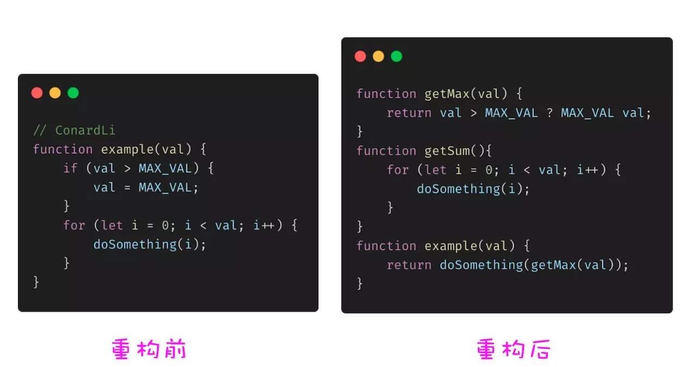
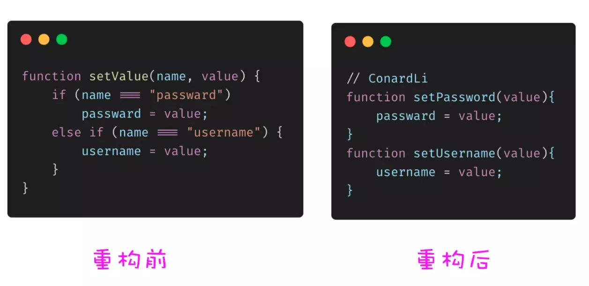
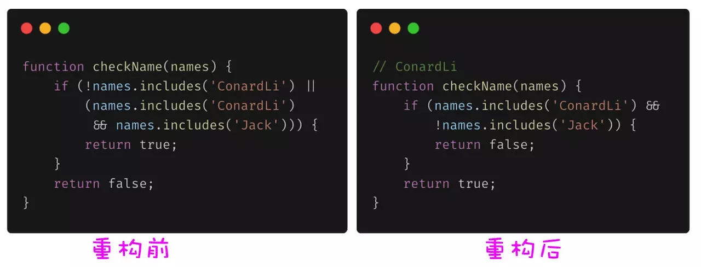
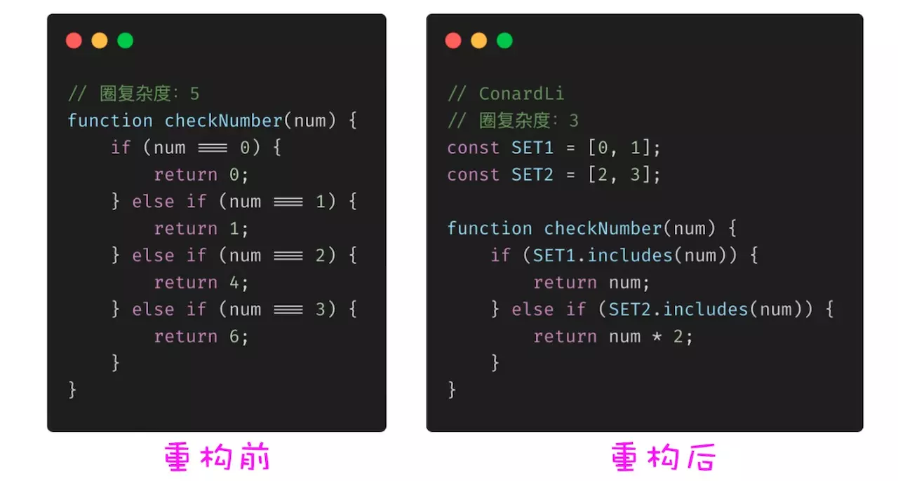
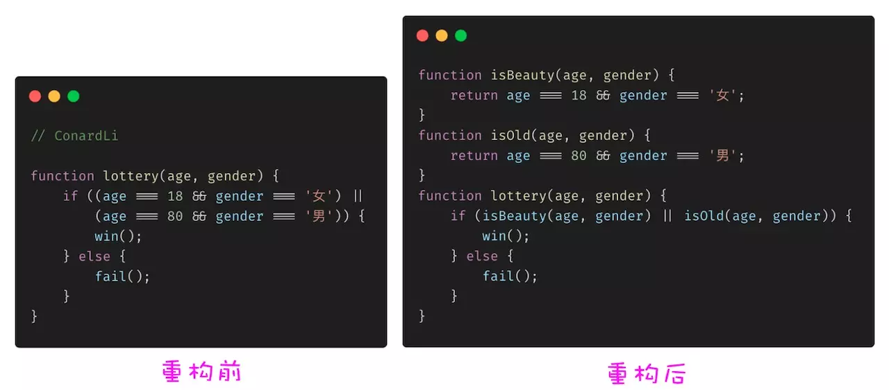

# 关于代码
:::tip
写程序时时刻记着，这个将来要维护你写的程序的人是一个有严重暴力倾向，并且知道你住在哪里的精神变态者。
:::

## 单一职责 - 提炼函数
单一职责原则（SRP）：每个类都应该有一个单一的功能，一个类应该只有一个发生变化的原因。
在 JavaScript 中，需要用到的类的场景并不太多，单一职责原则则是更多地运用在对象或者方法级别上面。

:::tip
函数应该做一件事，做好这件事，只做这一件事。 — 代码整洁之道
:::

关键是如何定义这 “一件事” ，如何将代码中的逻辑进行抽象，有效的提炼函数有利于降低代码复杂度和降低维护成本。

## 用函数取代参数
setField 和 getField 函数就是典型的函数取代参数，如果么有 setField、getField 函数，我们可能需要一个很复杂的 setValue、getValue 来完成属性赋值操作：

## 简化条件判断 - 逆向条件
某些复杂的条件判断可能逆向思考后会变的更简单。

## 简化条件判断 -合并条件
将复杂冗余的条件判断进行合并。

## 简化条件判断 - 提取条件
将复杂难懂的条件进行语义化提取。

