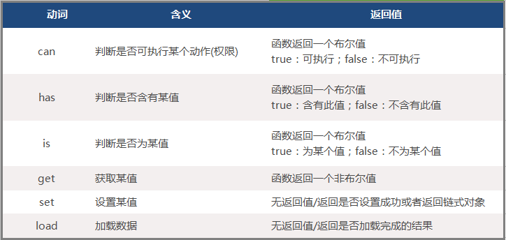

# 命名规范

## 驼峰式命名法介绍
驼峰式命名法由小(大)写字母开始，后续每个单词首字母都大写。
按照第一个字母是否大写，分为：
- Pascal Case 大驼峰式命名法：首字母大写。eg：StudentInfo、UserInfo、ProductInfo
- Camel Case 小驼峰式命名法：首字母小写。eg：studentInfo、userInfo、productInfo

## 变量
- 命名方法：小驼峰式命名法
- 命名规范：前缀应当是名词。(函数的名字前缀为动词，以此区分变量和函数)
- 命名建议：尽量在变量名字中体现所属类型，如:length、count等表示数字类型；而包含name、title表示为字符串类型

```js
// 推荐
var maxCount = 10;
var tableTitle = 'LoginTable';
// 不推荐
var setCount = 10;
var getTitle = 'LoginTable';
```
## 常量
- 命名方法：名称全部大写
- 命名规范：使用大写字母和下划线来组合命名，下划线用以分割单词

```js
var MAX_COUNT = 10;
var URL = 'http://www.xxx.com';
```

## 函数
- 命名方法：小驼峰式命名法
- 命名规范：前缀应当是名词。(函数的名字前缀为动词，以此区分变量和函数)
- 命名建议：参考下表




```js
// 是否可阅读
function canRead() {
    return true;
}

// 获取名称
function getName() {
    return this.name;
}
```

## 构造函数
- 命名方法：大驼峰式命名法，首字母大写
```js
function Student(name) {
    this.name = name;
}
var st = new Student('tom');
```

